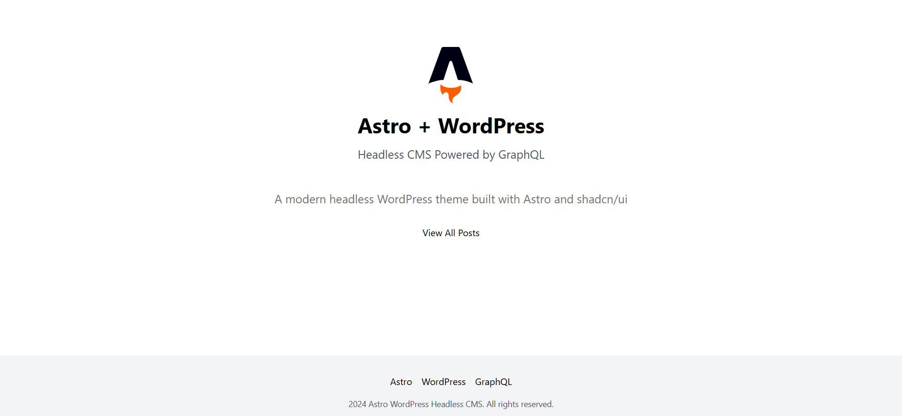

# AstroWP WordPress Theme

## 🚀 Project Overview

AstroWP is a modern, high-performance WordPress theme built with cutting-edge web technologies. Designed for speed, accessibility, and elegant user experience.



## 🌟 Features

- **Blazing Fast Performance**: Optimized for speed and Core Web Vitals
- **Responsive Design**: Looks great on all devices
- **Modern Tech Stack**: Leveraging Astro and Vue.js
- **Customizable**: Easily adaptable to various project needs

## 🛠 Tech Stack

- WordPress
- Astro
- Vue.js
- Tailwind CSS

## 📦 Installation

1. Clone the repository
2. Install dependencies:
   ```bash
   npm install
   ```
3. Configure your WordPress environment
4. Activate the theme in WordPress admin panel

## 🔧 Development

```bash
# Start development server
npm run dev

# Build for production
npm run build
```

## 🤝 Contributing

Contributions are welcome! Please read our [Contributing Guidelines](CONTRIBUTING.md) before getting started.

## 📄 License

This project is licensed under the MIT License.

## 🎨 Screenshots


---

Made with ❤️ by Your Name
